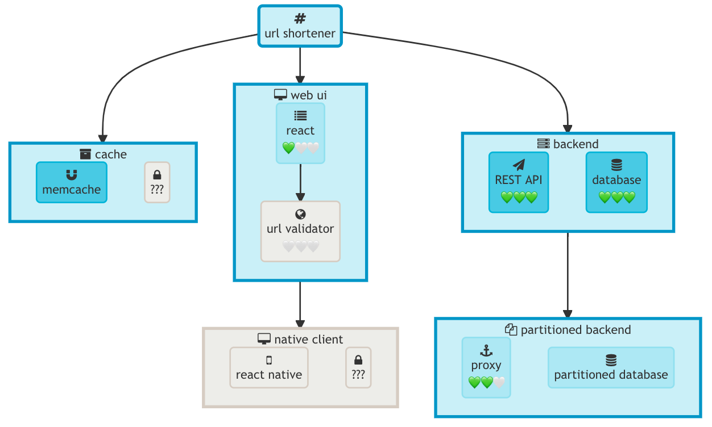

# skillmap
A tool for generating skill map/tree like diagram.

# What is a skill map/tree?
Skill tree is a term used in video games, and it can be used for describing roadmaps for software project development as well.

This project borrows inspiration and ideas from two sources:
1. https://hacks.mozilla.org/2018/10/webassemblys-post-mvp-future/
2. https://github.com/nikomatsakis/skill-tree

# Features
* skill tree/map generation
* specify pre-requisite skills
* multiple themes
* multiple skill progress bar styles
# Installation
```
pip install skillmap
```
After installation, a `skillmap` command is available.

# Usage
1. Create a toml format skill map descriptor file. You can find more details about this descriptor format [here](docs/skillmap_descriptor.md). For a minimal example, see [`docs/examples/hello_world.toml`](docs/examples/hello_world.toml)
```
[skillmap]
name = "hello world"
icon = "bicycle"

[groups.learn_python]
name = "learn python"
icon = "rocket"
    [groups.learn_python.skills.print]
    name = "print statement"
    icon = "printer"
    [groups.learn_python.skills.string]
    name = "string literal"
    icon = "book"
```

2. Run `skillmap path/to/your/skillmap.toml`
   1. For example, `skillmap docs/examples/hello_world.toml`
3. Copy the generated skill map diagram to your clipboard.
4. Paste the diagram to a mermaid diagram editor, for example, [`https://mermaid-js.github.io/mermaid-live-editor`](https://mermaid-js.github.io/mermaid-live-editor).

# Examples



* Each node can have a string label and an fontawsome icon.
* Skills with different statuses will be shown with different colors.
* Each skill may have a progress bar to indicate its learning progress.
* Pre-requisite skills will be connected with an directed edge.
* You can embed the generated mermaid diagram into github markdown directly, but the fontawesome icons in the diagrams are not shown by github so far.
* Unnamed skill (a skill node only has its toml table id but without any table property) will be shown as a locked skill. I find this is a useful analogy when you have a problem in your project that you don't have any clue how it should be solved yet.
* You can find the skill map toml for the above exmaples [here](tests/url_shortener.toml)

# License
[MIT License](LICENSE)

# More details
* Skillmap toml descriptor format can be found [here](docs/skillmap_descriptor.md)
* hot reloading when authoring a skillmap toml file
    * install several tools to make hot reloading to work
        * [`entr`](https://github.com/eradman/entr), run arbitrary commands when files change
        * [Visual Studio Code](https://code.visualstudio.com) + [Markdown Preview Enhanced Visual Studio Code Extension](https://marketplace.visualstudio.com/items?itemName=shd101wyy.markdown-preview-enhanced)
        * Basically, use `entr` to watch toml file changes, and generate a `md` makrdown file using `skillmap` every time when toml file changes. And use `vscode` + `Markdown Preview Enhanced` extension to open this generated markdown file. Check out `build_sample` and `dev_sample` in [justfile](justfile) to see how to make hot reloading work
# Known issues
* Sometimes, the group's text will be clipped when rendered in mermaid. And you have to edit the generated file slightly and then change it back to ask mermaid to refersh the diagram to avoid clipping. It is probably a bug for mermaid as far as I can tell. 